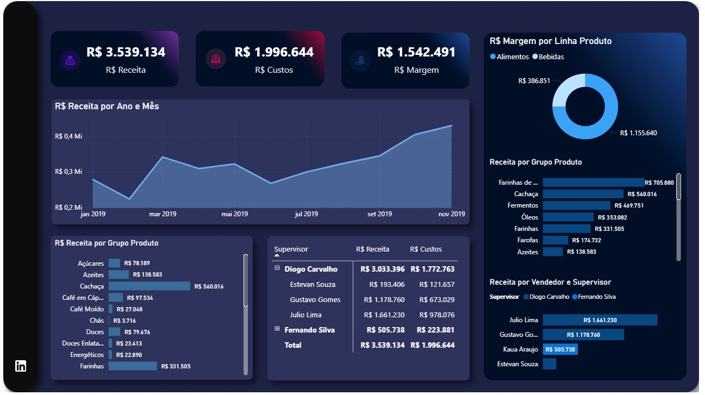

# Desempenho de Vendas — Dashboard Power BI (PBIP)

Este repositório apresenta um demonstrativo de vendas de um mercado, organizado em formato PBIP para versionamento e colaboração. A visão principal destaca os indicadores mais importantes para acompanhamento diário e tomada de decisão.

## Visualização online

Acesse o dashboard publicado no Power BI Service:

- https://app.powerbi.com/view?r=eyJrIjoiMWRmMDNmYzMtOGUyZS00ZjBiLTgxZDQtMmEzZWMzMjgwNzlkIiwidCI6IjA5ZjRiZmNhLTY3Y2QtNGU0Zi05NjNkLWExYzk1MzEyNmMwNCJ9

Observação: a visibilidade depende das permissões de compartilhamento no Power BI.

## Imagem do dashboard

Visual da página principal (pg01):

## Destaques do conteúdo

- Indicadores-chave de desempenho (KPIs) para vendas.
- Visão consolidada com filtros por período e dimensões operacionais.
- Suporte a análises rápidas de produtos/categorias e evolução temporal.

## Como abrir o projeto (PBIP)

1. Instale o Power BI Desktop (2023+ recomendado).
2. Clone este repositório localmente.
3. No Power BI Desktop, abra o arquivo PBIP localizado na pasta do projeto (Desempenho Vendas.Report / SemanticModel).

## Estrutura do repositório

- Arquivos PBIP do dashboard em pastas `Desempenho Vendas.Report` e `Desempenho Vendas.SemanticModel`.
- `assets/screenshots/pg01.jpg`: imagem padrão do dashboard.
- `LICENSE`: licença do projeto (MIT).

## Licença

Este projeto está licenciado sob os termos da licença MIT. Consulte o arquivo [LICENSE](LICENSE) para detalhes.
